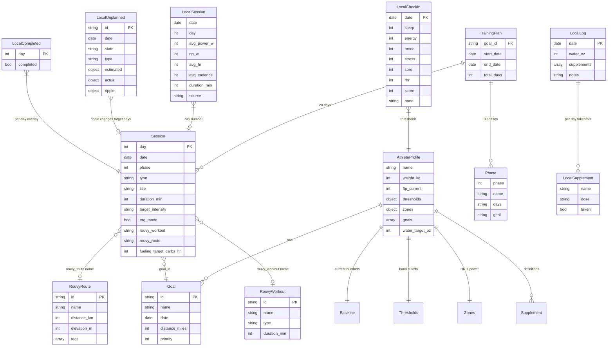
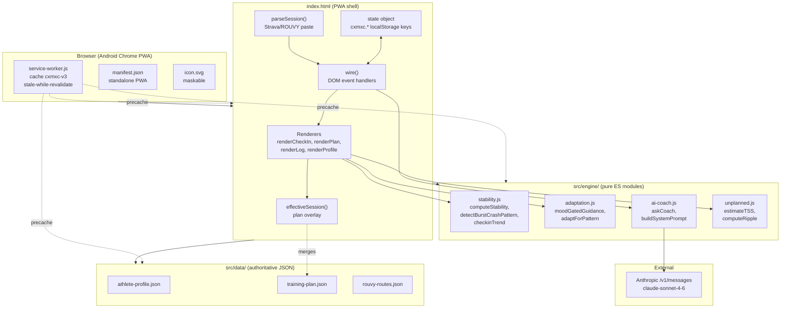
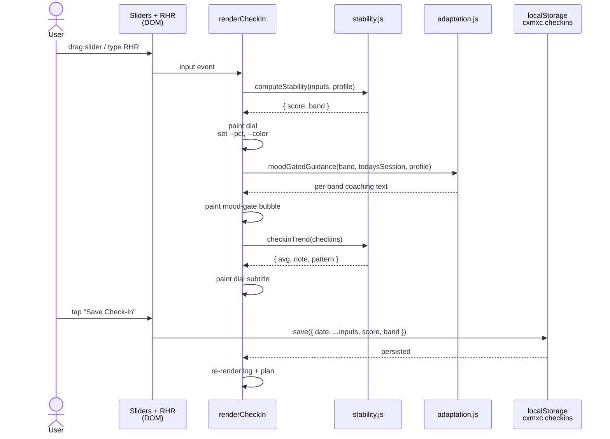
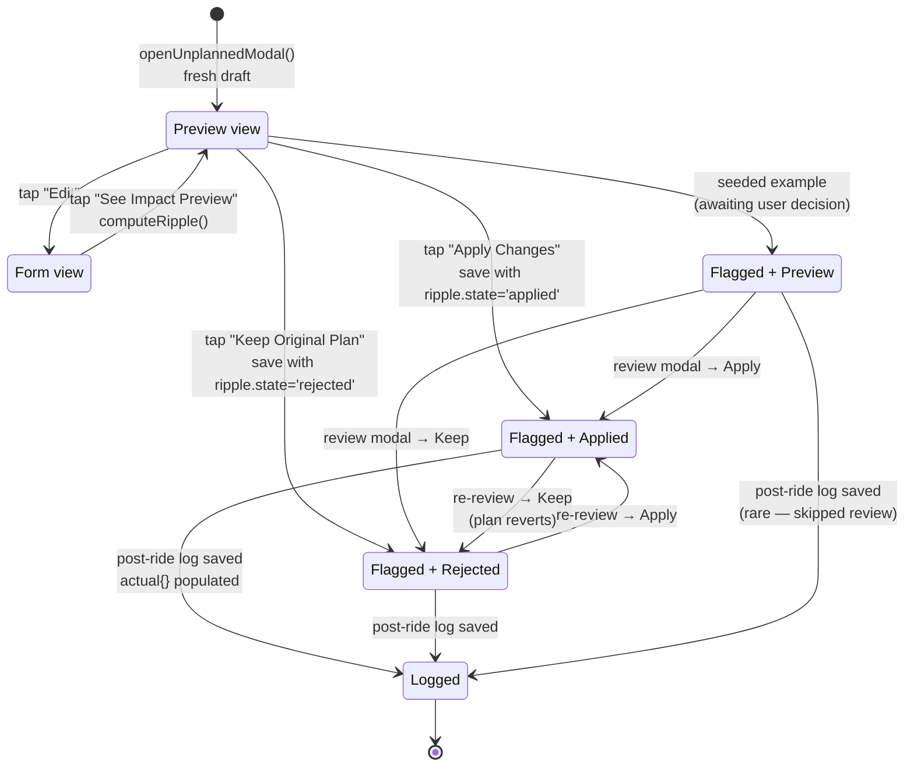

# Architecture — cxmxc-training

> Phase 1 deliverable. Backfilled in 2026-05-08 to document the architecture that emerged during the v0.1.0 build. The eventual shape is sound; the gap was that it was never drawn until now.

This document captures four views of the system:
1. **Data ERD** — what entities exist and how they reference each other.
2. **Component graph** — what code modules exist and what depends on what.
3. **State flows** — sequence diagrams for the two most load-bearing user paths.
4. **Lifecycle** — the unplanned-activity record's state machine.

All diagrams are Mermaid, inline. They render natively on GitHub and in any Markdown viewer that speaks Mermaid (Obsidian, VS Code with the Mermaid extension, etc.).

---

## 1. Data entity-relationship diagram

The product reads three authoritative JSON files at boot and persists user state under `cxmxc.*` keys in localStorage. Authoritative files are read-only by default (CLAUDE.md rule 1); local state is owned by the shell.



**Key invariants** (from `CLAUDE.md`):
- `AthleteProfile.baseline.ftp_current > 0`.
- `Thresholds.stability_score_green > stability_score_yellow > stability_score_red`.
- `goals` always contains at least one entry with `priority: 1`.
- `Session.length === TrainingPlan.total_days` (currently 20).
- `Session.date` is strictly increasing day-over-day.
- Every non-null `Session.rouvy_workout` and `Session.rouvy_route` resolves to a `name` in `rouvy-routes.json`.

---

## 2. Component graph

How the code is organized. The shell wires DOM events to engine modules; engine modules read from JSON data and return plain values. No engine module touches the DOM or localStorage.



**Module responsibilities (from each module's file header):**
- `stability.js` — daily readiness score from 5 sliders + RHR; burst-crash pattern detection (3-yellow, red, descending). No DOM, no storage.
- `adaptation.js` — turns stability band into per-band coaching text and structured session adaptations. Language rules locked.
- `ai-coach.js` — Anthropic Messages API wrapper. Enforces "every prompt includes today's mood gate band and stability score" (CLAUDE.md rule 10).
- `unplanned.js` — TSS estimation, ripple computation, coaching-note generation in the field-training language.

**Shell responsibilities:**
- Render screens from state.
- Wire DOM events to handlers.
- Persist state under `cxmxc.*`.
- Apply read-time overlays (`effectiveSession`) so authoritative JSON is never mutated.

---

## 3. State flow — daily check-in

The most-used user path. Every input updates the dial live; saving persists the check-in and re-renders the log.



---

## 4. State flow — unplanned activity (flag → preview → apply)

The second-most-load-bearing path. Demonstrates how the engine produces a structured ripple and how the shell turns it into a non-destructive plan overlay.

```mermaid
sequenceDiagram
    actor User
    participant Banner as Check-In banner
    participant Modal as Pre-ride modal
    participant Unp as unplanned.js
    participant Plan as training-plan.json<br/>(in memory)
    participant Storage as localStorage<br/>cxmxc.unplanned
    participant PlanScreen as renderPlan +<br/>effectiveSession

    User->>Banner: tap "Flag Unplanned Activity"
    Banner->>Modal: openUnplannedModal()<br/>fresh draft, date = tomorrow
    User->>Modal: pick type, distance, duration,<br/>intensity, time of day
    Modal->>Unp: estimateTSS(duration, intensity)
    Unp-->>Modal: tss
    Modal->>Modal: paint live TSS readout

    User->>Modal: tap "See Impact Preview"
    Modal->>Unp: computeRipple(draft, plan)
    Unp->>Plan: lookup ride day + downstream days
    Plan-->>Unp: prescribed sessions
    Unp-->>Modal: { changes[], coachingNote, bucket }
    Modal->>Modal: paint before/after cards

    alt User taps "Apply Changes"
        Modal->>Storage: saveUnplanned(draft<br/>state='flagged',<br/>ripple.state='applied')
        Modal->>PlanScreen: renderAll()
        PlanScreen->>Storage: load cxmxc.unplanned
        PlanScreen->>PlanScreen: buildAdjustmentOverlay()
        PlanScreen->>PlanScreen: effectiveSession(s) per day<br/>merges overlay at render
        Note over PlanScreen: training-plan.json never mutated
    else User taps "Keep Original Plan"
        Modal->>Storage: saveUnplanned(draft<br/>state='flagged',<br/>ripple.state='rejected')
        Note over PlanScreen: plan renders unchanged;<br/>flag remains for later logging
    end
```

---

## 5. Lifecycle — unplanned record state machine

A single unplanned-activity record moves through these states. Independent axes: the record's `state` (flagged / logged / ignored) and the ripple's `state` (preview / applied / rejected).



**Notes on the state machine:**
- `Flagged + Applied` is the only state in which the ripple actually overlays the plan at render time.
- `Flagged + Rejected` keeps the flag (so the activity can be logged after) but the plan renders unchanged.
- The seeded "tomorrow's group ride" example starts in `Flagged + Preview` so the user must consciously decide.
- Logging an activity (filling in `actual{}`) is the terminal state; the record stays for history.

---

## 6. External dependencies

Listed for completeness; security review touches each one.

| Dependency | Purpose | When it's contacted | Failure mode |
|---|---|---|---|
| Google Fonts (`fonts.googleapis.com`, `fonts.gstatic.com`) | Bebas Neue + DM Mono | First load; cached by SW + browser thereafter | Falls back to system fonts; aesthetic degrades, function unaffected |
| Anthropic API (`api.anthropic.com`) | AI coach calls | Only when user taps "Ask Coach Now" | `{ ok:false, text: <error> }` rendered in coach bubble; rest of app unaffected |

No analytics, no tracking, no third-party CDNs beyond fonts. No backend.

---

## 7. Security and privacy considerations

(Cross-reference: `CLAUDE.md` rule 8 — compliance posture; this section is the design-level companion.)

- **Athlete profile is personal-health-adjacent data.** It lives in the source tree as JSON because v1 is single-user single-device, but it must not be logged remotely, embedded in URLs, or auto-shared.
- **API key handling.** The Anthropic key is entered in the Profile screen and stored *only* in `localStorage` on the device. It is not in source, not in `.env.example`, not in any commit. Browser-direct fetch uses the key in an `x-api-key` header to `api.anthropic.com` only.
- **AI coach prompt scope.** `buildSystemPrompt()` in `ai-coach.js` sends a curated subset of the profile (name, age, weight, FTP, cadence, breathing condition, mental-health framing, today's session, today's mood gate band/score, recent log digest). The full athlete profile is never sent.
- **No CORS bypass, no eval, no innerHTML on untrusted input.** All user-supplied text passes through `escapeHtml()` before innerHTML.
- **Service worker scope** is same-origin. Cross-origin requests (Anthropic, Google Fonts) bypass the worker and go straight to the network.
- **CLAUDE.md rule 1** protects the two authoritative JSON files from silent overwrite; the unplanned-activity ripple proves the pattern works (overlay at render time, JSON never mutated).

For the Phase 4 security checklist results, see `docs/SECURITY.md`.
